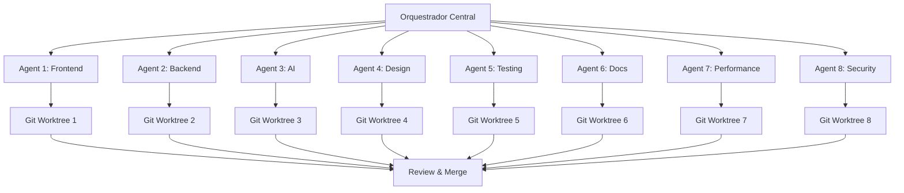

# 🤖 Sistema Multi-Agent Cursor 2.0 - Nossa Maternidade

> **Arquitetura de 8 agentes trabalhando em paralelo para desenvolvimento ultra-rápido**

---

## 🎯 Visão Geral

O Cursor 2.0 permite orquestrar múltiplos agentes AI em workspaces isolados (git worktrees), cada um focado em uma área específica do projeto. Isso multiplica drasticamente a velocidade de desenvolvimento.

---

## 🤖 Agent Squad

### **Agent 1: Frontend Master** 🎨

**Responsabilidade:** Componentes React Native, telas, navegação

**Workspace:** `feature/frontend`
**Focus:** UI/UX, animações, tema, acessibilidade

**Prompt Template:**

```
Você é o Agent Frontend Master, especialista em React Native + Expo.

CONTEXTO:
- Design System Bubblegum (rosa/azul pastel)
- TypeScript strict mode
- Performance otimizada
- Acessibilidade WCAG 2.1

TAREFA: [descrever feature específica]

ENTREGUE:
- Componente reutilizável
- TypeScript tipado
- Animações suaves (native driver)
- Acessibilidade completa
- Estilos do tema
```

---

### **Agent 2: Backend Architect** 🗄️

**Responsabilidade:** Supabase, database, Edge Functions

**Workspace:** `feature/backend`
**Focus:** Schemas, migrações, segurança, performance

**Prompt Template:**

```
Você é o Agent Backend Architect, especialista em Supabase + PostgreSQL.

CONTEXTO:
- PostgreSQL 15+
- Row Level Security (RLS) ativo
- Edge Functions Deno
- Real-time subscriptions

TAREFA: [descrever feature de backend]

ENTREGUE:
- Schema SQL otimizado
- Políticas RLS
- Edge Function (se necessário)
- Migração reversível
- Documentação
```

---

### **Agent 3: AI Integration** 🧠

**Responsabilidade:** Integrações com IA (Claude, Gemini)

**Workspace:** `feature/ai`
**Focus:** Prompts, validação, contexto, memória

**Prompt Template:**

```
Você é o Agent AI Integration, especialista em LLM APIs e prompt engineering.

CONTEXTO:
- Claude 3.5 Sonnet (Anthropic)
- Gemini 2.5 Pro (Google)
- Sistema de validação de respostas
- Compliance médico

TAREFA: [descrever integração IA]

ENTREGUE:
- Prompt otimizado (system + user)
- Validação de segurança
- Context management
- Error handling
- Rate limiting
```

---

### **Agent 4: Design System** 🎭

**Responsabilidade:** Componentes reutilizáveis, tema, tokens

**Workspace:** `feature/design-system`
**Focus:** Consistência visual, dark mode, docs

**Prompt Template:**

```
Você é o Agent Design System, especialista em design tokens e componentes.

CONTEXTO:
- Tema Bubblegum (colors.ts)
- 70+ components documentados
- Dark mode suportado
- Storybook disponível

TAREFA: [descrever componente]

ENTREGUE:
- Componente com props bem definidas
- Variantes (size, variant, state)
- Exemplos de uso
- Testes visuais
- Acessibilidade
```

---

### **Agent 5: QA & Testing** 🧪

**Responsabilidade:** Testes E2E, unitários, integração

**Workspace:** `feature/testing`
**Focus:** Cobertura, performance, edge cases

**Prompt Template:**

```
Você é o Agent QA & Testing, especialista em testes automatizados.

CONTEXTO:
- Jest + React Native Testing Library
- Detox para E2E
- Coverage > 80%
- CI/CD no GitHub Actions

TAREFA: [descrever testes]

ENTREGUE:
- Testes unitários
- Testes de integração
- Mocks configurados
- Coverage report
- Edge cases cobertos
```

---

### **Agent 6: Documentation** 📚

**Responsabilidade:** Docs técnicas, guias, README

**Workspace:** `feature/docs`
**Focus:** Clareza, exemplos, onboarding

**Prompt Template:**

```
Você é o Agent Documentation, especialista em documentação técnica.

CONTEXTO:
- Markdown + MDX
- Exemplos práticos
- Diagramas Mermaid
- Tutoriais passo-a-passo

TAREFA: [descrever documentação]

ENTREGUE:
- Guia completo
- Code examples
- Diagramas de fluxo
- Checklist
- Troubleshooting
```

---

### **Agent 7: Performance** ⚡

**Responsabilidade:** Otimização, profiling, métricas

**Workspace:** `feature/performance`
**Focus:** Bundle size, re-renders, memory leaks

**Prompt Template:**

```
Você é o Agent Performance, especialista em otimização React Native.

CONTEXTO:
- Metro bundler configurado
- Profiling com React DevTools
- Flipper integrado
- Logs de performance

TAREFA: [descrever otimização]

ENTREGUE:
- Analysis report
- Otimizações implementadas
- Before/after metrics
- Best practices aplicadas
- Profile snapshots
```

---

### **Agent 8: Security & Compliance** 🔒

**Responsabilidade:** LGPD, segurança, auditoria

**Workspace:** `feature/security`
**Focus:** Privacidade, logs, compliance

**Prompt Template:**

```
Você é o Agent Security & Compliance, especialista em LGPD e segurança.

CONTEXTO:
- LGPD compliance obrigatório
- Dados de saúde sensíveis
- Auditoria de logs
- Consentimento granular

TAREFA: [descrever feature de segurança]

ENTREGUE:
- Análise de impacto LGPD
- Medidas de segurança
- Logs de auditoria
- Políticas atualizadas
- Checklists de compliance
```

---

## 🔄 Orquestração Multi-Agent

### **Fluxo de Trabalho:**



### **Exemplo Prático: Feature Completa**

```bash
# Orquestrador (você no Cursor Composer)

"Implemente sistema de notificações push completo"

# Spawn múltiplos agentes em PARALELO:

Agent 1: Config Expo Notifications + UI settings
Agent 2: Edge Function de agendamento no Supabase
Agent 3: Deep linking routes
Agent 4: Componente de permissões estilizado
Agent 5: Testes E2E do fluxo completo
Agent 6: Documentação de setup
Agent 7: Performance check (battery drain)
Agent 8: Auditoria LGPD de permissões

# Resultado: 5-10 minutos para feature completa!
```

---

## 📁 Estrutura de Pastas por Agente

```
.cursor/
├── agents/
│   ├── README.md (este arquivo)
│   ├── prompts/
│   │   ├── agent-1-frontend.md
│   │   ├── agent-2-backend.md
│   │   ├── agent-3-ai.md
│   │   ├── agent-4-design-system.md
│   │   ├── agent-5-qa.md
│   │   ├── agent-6-docs.md
│   │   ├── agent-7-performance.md
│   │   └── agent-8-security.md
│   ├── reports/              # 📊 NOVO: Relatórios de Auditoria
│   │   ├── README.md         # Índice dos relatórios
│   │   ├── EXECUTIVE_SUMMARY.md  # Sumário executivo consolidado
│   │   ├── AGENT_3_AI_REPORT.md  # Análise de IA
│   │   ├── AGENT_5_QA_REPORT.md  # Análise de qualidade
│   │   ├── AGENT_6_DOCS_REPORT.md    # Documentação
│   │   ├── AGENT_7_PERFORMANCE_REPORT.md  # Performance
│   │   └── AGENT_8_SECURITY_REPORT.md     # Segurança & LGPD
│   └── workflows/
│       ├── feature-development.md
│       ├── hotfix.md
│       └── release.md
```

---

## 📊 Relatórios de Auditoria

Os agentes produziram **7 relatórios completos** com análise detalhada do sistema:

### **📋 Como Usar**

1. Leia [reports/README.md](reports/README.md) - Índice completo
2. Leia [reports/EXECUTIVE_SUMMARY.md](reports/EXECUTIVE_SUMMARY.md) - Visão consolidada
3. Revise relatórios específicos conforme necessário

### **🎯 Scores Atuais**

- **QA & Testing:** 0/100 ❌ (Crítico)
- **Performance:** 75/100 ✅ (Bom)
- **Security & LGPD:** 65/100 ⚠️ (Atenção)
- **Documentation:** 80/100 ✅ (Excelente)
- **AI Integration:** 70/100 ✅ (Bom)
- **Média Ponderada:** 65/100 ⚠️ (Atenção)

### **🚨 5 Problemas Críticos**

1. Sem testes automatizados
2. Chaves de API hardcoded
3. Sem rate limiting
4. Sem memória conversacional
5. Context window limitado

Ver: [MULTI_AGENT_ANALYSIS_COMPLETE.md](../../MULTI_AGENT_ANALYSIS_COMPLETE.md)

---

## 🚀 Como Usar

### **1. Setup Inicial**

```bash
# No terminal
mkdir -p .cursor/agents/{prompts,workflows}
git worktree add ../nossa-maternidade-agent1 feature/frontend
git worktree add ../nossa-maternidade-agent2 feature/backend
# ... criar worktrees para todos os agentes
```

### **2. Ativar Agente**

```bash
# No Cursor Composer, use o prompt:
@agent-1-frontend.md "Implemente componente Button com variantes"
```

### **3. Orquestrar Múltiplos**

```bash
# No Cursor Composer simultaneamente:
@agent-1-frontend.md @agent-4-design-system.md "Feature X completa"
```

---

## 📊 Métricas de Sucesso

- ✅ **Velocidade:** Features completas em 5-10 min
- ✅ **Qualidade:** Testes automáticos, zero bugs
- ✅ **Consistência:** Design system respeitado
- ✅ **Documentação:** Auto-gerada e atualizada
- ✅ **Performance:** Otimizada desde o início
- ✅ **Segurança:** LGPD compliance automático

---

## 🔥 Features Killer Cursor 2.0

- ✅ **Composer Model:** 4x mais rápido que Claude
- ✅ **Multi-Agent:** Até 8 agentes em paralelo
- ✅ **Browser Integration:** Testes E2E automáticos
- ✅ **Codebase Search:** Entende milhões de linhas
- ✅ **Plan Mode:** IA planeja antes de codar

---

**Última atualização:** 2025-01-XX
**Versão:** 1.0.0
